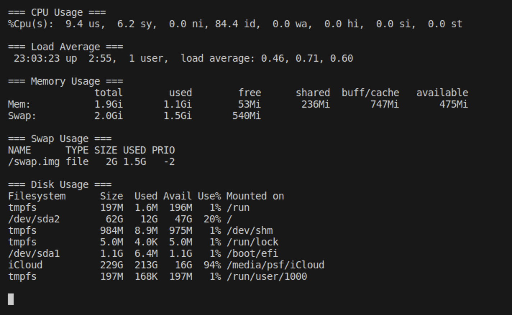

# sys_monitor
The System Activity Monitor Tool is a lightweight and real-time utility for tracking and visualizing essential system performance metrics.

## Getting Started

To run this project on your machine, follow these steps:

1. Install Go: Download and install Go from the official website [https://golang.org/dl/](https://golang.org/dl/).

2. Clone the repository:
   ```bash
   git clone https://github.com/imanetec/sys_monitor
   cd sys_monitor
3. Fetch dependencies: Run the following command to install project dependencies defined in the go.mod file:
    ```bash 
    go mod download

## Fetching statistics we need 


